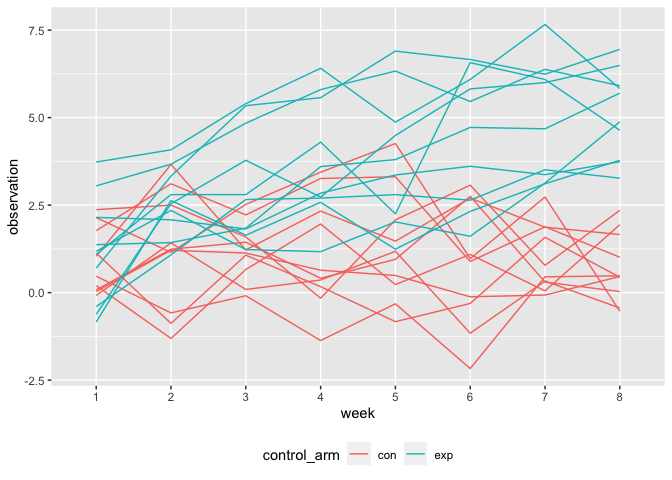

p8105\_hw5\_lcc2181
================

Loading the packages needed for Homework 5.

``` r
library(tidyverse)
library(purrr)
```

## Problem 1

Importing and cleaning the data.

``` r
homicide_df =
  read_csv("data/homicide_data.csv", na = c("", "Unknown")) %>% 
  mutate(
    city_state = str_c(city, state),
    resolution = case_when(
      disposition == "Closed without arrest" ~ "unsolved",
      disposition == "Open/No arrest" ~ "unsolved",
      disposition == "Closed by arrest" ~ "solved"
  )) %>% 
  relocate(city_state) %>% 
  filter(city_state != "TulsaAL")
```

Focusing on Baltimore, MD.

``` r
baltimore_df =
  homicide_df %>% 
  filter(city_state == "BaltimoreMD")

baltimore_summary =
  baltimore_df %>%
  summarize(
      unsolved = sum(resolution == "unsolved"),
      n = n()
  )
 
baltimore_test =
  prop.test(
    x = baltimore_summary %>% pull(unsolved),
    n = baltimore_summary %>% pull(n)
  ) 

baltimore_test %>% 
  broom::tidy()
```

    ## # A tibble: 1 × 8
    ##   estimate statistic  p.value parameter conf.low conf.high method    alternative
    ##      <dbl>     <dbl>    <dbl>     <int>    <dbl>     <dbl> <chr>     <chr>      
    ## 1    0.646      239. 6.46e-54         1    0.628     0.663 1-sample… two.sided

Trying to iterate across cities.

First, write a function and test on a few sample cities.

``` r
prop_test_function = function(city_df) {
  
  city_summary =
  city_df %>%
  summarize(
      unsolved = sum(resolution == "unsolved"),
      n = n()
  )
 
  city_test =
    prop.test(
     x = city_summary %>% pull(unsolved),
     n = city_summary %>% pull(n)
    ) 

  return(city_test)
  
}

prop_test_function(baltimore_df)
```

    ## 
    ##  1-sample proportions test with continuity correction
    ## 
    ## data:  city_summary %>% pull(unsolved) out of city_summary %>% pull(n), null probability 0.5
    ## X-squared = 239.01, df = 1, p-value < 2.2e-16
    ## alternative hypothesis: true p is not equal to 0.5
    ## 95 percent confidence interval:
    ##  0.6275625 0.6631599
    ## sample estimates:
    ##         p 
    ## 0.6455607

``` r
homicide_df %>% 
  filter(city_state == "AlbuquerqueNM") %>% 
  prop_test_function()
```

    ## 
    ##  1-sample proportions test with continuity correction
    ## 
    ## data:  city_summary %>% pull(unsolved) out of city_summary %>% pull(n), null probability 0.5
    ## X-squared = 19.114, df = 1, p-value = 1.232e-05
    ## alternative hypothesis: true p is not equal to 0.5
    ## 95 percent confidence interval:
    ##  0.3372604 0.4375766
    ## sample estimates:
    ##         p 
    ## 0.3862434

Next, iterate across all cities.

``` r
results_df =
  homicide_df %>% 
  nest(data = uid:resolution) %>% 
  mutate(
    test_results = map(data, prop_test_function),
    tidy_results = map(test_results, broom::tidy)
  ) %>% 
  select(city_state, tidy_results) %>% 
  unnest(tidy_results) %>% 
  select(city_state, estimate, starts_with("conf"))
```

Plot showing estimates and CIs.

``` r
results_df %>%
  mutate(city_state = fct_reorder(city_state, estimate)) %>% 
  ggplot(aes(x = city_state, y = estimate)) +
  geom_point() +
  geom_errorbar(aes(ymin = conf.low, ymax = conf.high)) +
  theme(axis.text.x = element_text(angle = 90, vjust = 0.5, hjust = 1))
```

<!-- -->

## Problem 2

Creating a dataframe with all file names using the `list.files`
function.

``` r
file_names = list.files(path = "data/problem2", full.names = TRUE)
```

Iterating over file names and reading in data for each subject using
`map:dfr` to produce a single data frame.

``` r
p2_df =
  tibble(
    file_names,
    map_dfr(file_names, read_csv)
  )
```

Tidying the resulting data frame:

-   Manipulating file names separate control arm and subject id into
    their own columns and removing all other aspects of file name
-   Tidying weekly observations to ensure that each observation for each
    week is in a separate row for each participant.

``` r
p2_tidy_df =
  p2_df %>% 
  separate(file_names, into = c("folder_1", "folder_2", "name"), sep = "/") %>% 
  separate(name, into = c("control_arm", "other"), sep = "_") %>% 
  separate(other, into = c("subject_id", "file_type")) %>% 
  select(-folder_1, -folder_2, -file_type) %>% 
  pivot_longer (
    week_1:week_8,
    names_to = "week",
    names_prefix = "week_",
    values_to = "observation"
  )
```

Creating a spaghetti plot with observations for each subject across 8
weeks…

``` r
p2_tidy_df %>% 
  mutate(unique_id = paste(control_arm, subject_id)) %>% 
  ggplot(aes(x = week, y = observation, group = unique_id, color = control_arm)) +
  geom_line() +
  theme(legend.position = "bottom")
```

<!-- -->

At week 1, there do not appear to be major differences between subjects
in the control arm and the experimental arm. Over time, observations for
those in the experimental arm generally appear to increase; the same
pattern is not apparent for those in the control arm. By week 8, all
subjects in the experimental group have higher observations compared to
those in the control group.

## Problem 3

Code chunk which loads `iris` dataset and introduces missing values in
each column.

``` r
library(tidyverse)

set.seed(10)

iris_with_missing = iris %>% 
  map_df(~replace(.x, sample(1:150, 20), NA)) %>%
  mutate(Species = as.character(Species))
```

Writing a function `replace_missing` that replaces missing values with
the mean of non-missing values for numeric values and for character
variables fills in missing values with “virginica”

``` r
replace_missing = function(x) {
  
  if (is.numeric(x)) {
    
    replace_na(x, mean(x, na.rm = TRUE)) %>% 
    round(digits = 1)
    
  }
  
  else if (is.character(x)) {
  
    replace_na(x, "virginica")
    
  }
                                
}
```

Using `map_dfr` to apply function `replace_missing` to columns of
iris\_with\_missing.

``` r
output = map_dfr(iris_with_missing, replace_missing)
```
